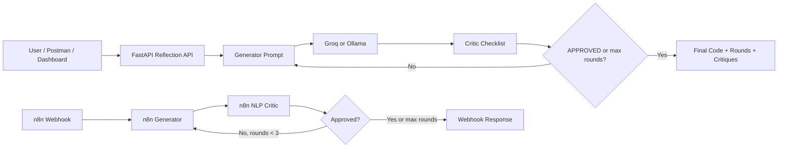

# Reflection Pattern Code Review Agent

Professional lab submission for **M Abdullah Fawad**. This project implements the Agentic AI **Reflection Pattern** in FastAPI, swaps the provider from Groq to local Ollama, and includes an importable n8n workflow for the graded visual workflow task.

## Architecture



## Project Files

- `main.py` - Groq FastAPI reflection agent on port `8000`.
- `main_ollama.py` - Ollama FastAPI reflection agent on port `8001`.
- `n8n/reflection_workflow.json` - importable n8n workflow for the visual graded task.
- `screenshots/` - submission screenshots with the exact required filenames.
- `.env.example` - safe template for local secrets.

## Setup

```bash
python -m venv .venv
.venv\Scripts\activate
pip install -r requirements.txt
copy .env.example .env
```

Paste your Groq key into `.env`:

```bash
GROQ_API_KEY=your_real_key_here
```

Do not commit `.env`.

## Run Groq Version

```bash
uvicorn main:app --reload --port 8000
```

Open:

- Dashboard: `http://127.0.0.1:8000/`
- Docs: `http://127.0.0.1:8000/docs`
- Health: `http://127.0.0.1:8000/health`

## Run Ollama Version

Confirm the model exists:

```bash
ollama pull qwen2.5:0.5b
ollama list
```

Run the local provider version:

```bash
uvicorn main_ollama:app --reload --port 8001
```

Open:

- Dashboard: `http://127.0.0.1:8001/`
- Docs: `http://127.0.0.1:8001/docs`
- Health: `http://127.0.0.1:8001/health`

## API Example

```http
POST http://127.0.0.1:8000/reflect
Content-Type: application/json
```

```json
{
  "task": "Write a Python function that checks if a string is a palindrome.",
  "max_rounds": 3
}
```

Expected response shape:

```json
{
  "final_code": "def is_palindrome(...): ...",
  "round_count": 2,
  "approved": true,
  "critiques": [
    "ISSUE [Edge cases]: ...",
    "APPROVED"
  ]
}
```

## n8n Workflow

Import `n8n/reflection_workflow.json` into n8n. Create an HTTP Header Auth credential named **Groq Header Auth**:

- Header name: `Authorization`
- Header value: `Bearer YOUR_GROQ_API_KEY`

The workflow receives:

```json
{
  "task": "Write a Python function that normalizes Unicode text and returns a safe word count.",
  "max_rounds": 3
}
```

It returns:

```json
{
  "final_code": "...",
  "round_count": 3,
  "approved": false,
  "critiques": ["..."]
}
```

## Graded Task 1 Reflection Answer

The reflection loop is independent from the model provider because the architecture is the same in both files: generator, critic, critique trace, approval check, and max-round stop. Groq and Ollama only change how `call_llm()` sends a prompt and reads a response. This proves an Agentic AI design pattern is a reusable workflow, not a single platform feature. The LLM is the engine, but the pattern is the control structure around it. A good implementation keeps that control structure stable while providers can be swapped.

## Graded Task 2 Domain Justification

I chose the NLP/text-processing critic because the generator task asks for Python functions that process user text. Unicode, encoding, malformed input, and large-input performance are real quality risks in text systems. This checklist makes the critic domain-specific instead of giving generic code-review feedback.

## Screenshot Checklist

The `screenshots/` folder contains:

- `health_groq.png`
- `reflect_groq.png`
- `health_ollama.png`
- `reflect_ollama.png`
- `n8n_workflow.png`
- `n8n_response.png`

## Evaluation Mapping

- Solved activity server: `main.py`, `/health`, `/reflect`, dashboard.
- Solved activity loop behavior: `critiques[]`, `APPROVED`, `max_rounds`.
- Graded Task 1: `main_ollama.py`, same schema, Ollama provider.
- Graded Task 2: `n8n/reflection_workflow.json`, visual generator-critic loop, NLP critic, max-round counter.
- Submission evidence: `screenshots/` and this README.
